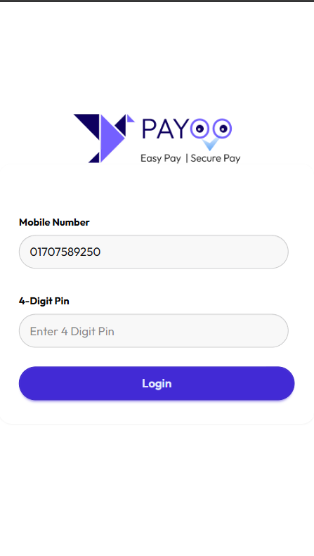

<div align="center">


# 💳 PAYOO

### Smart Mobile Financial Services Interface

**A modern, client-side MFS web app for seamless digital banking — no backend required.**


</div>

---

## Overview

**PAYOO** is a smart Mobile Financial Services (MFS) interface that delivers a seamless digital banking experience in the browser. Built entirely with HTML, Tailwind CSS, DaisyUI, and Vanilla JavaScript, it provides users with an intuitive platform to manage everyday financial tasks — from sending money to paying bills — without any backend dependency.

---

## Features

- 🔐 **Secure Login UI** — clean authentication screen with form validation
- 💰 **Add Money** — top up your wallet balance with ease
- 💸 **Transfer Money** — send funds to any registered user instantly
- 🧾 **Pay Bills** — manage utility and service bill payments
- 🏧 **Cash Out** — withdraw funds via agent or machine
- 🎁 **Bonus & Rewards** — track and redeem loyalty bonuses
- 🤖 **Machine Interactions** — ATM/MFS machine-based transaction flows
- 📱 **Fully Responsive** — optimized for mobile, tablet, and desktop
- ⚡ **Zero Dependencies** — no build step, no server, just open and run

---

## UI

<div align="center">

<table>
  <tr>
    <td align="center"><b>Login Screen</b></td>
    <td align="center"><b>Home Dashboard</b></td>
  </tr>
  <tr>
    <td></td>
    <td></td>
  </tr>
  <tr>
    <td align="center"><b>Cash Out</b></td>
    <td align="center"><b>Pay Bills</b></td>
  </tr>
  <tr>
    <td></td>
    <td></td>
  </tr>
</table>

</div>


---

## Tech Stack

| Layer | Technology |
|---|---|
| Markup | HTML5 |
| Styling | [Tailwind CSS](https://tailwindcss.com) + [DaisyUI](https://daisyui.com) |
| Scripting | Vanilla JavaScript (ES6+) |
| Config | `tailwind.config.js` for custom theming |
| Hosting | Static files — no build step required |

---

## Getting Started

### Prerequisites

None. This project runs entirely in the browser.

### Installation

```bash
# 1. Clone the repository
git clone https://github.com/yourusername/payoo.git

# 2. Navigate into the project
cd payoo

# 3. Open in your browser
open index.html
```

> **Tip:** For live reload during development, use the [Live Server](https://marketplace.visualstudio.com/items?itemName=ritwickdey.LiveServer) VS Code extension.

### Tailwind CSS

Tailwind is loaded via CDN by default. If you want to customize the theme or purge unused styles for production:

```bash
# Install dependencies
npm install

# Build Tailwind
npx tailwindcss -i ./input.css -o ./assets/output.css --watch
```

---

## Project Structure

```
payoo/
├── index.html              # Login / entry point
├── home.html               # Main dashboard
├── tailwind.config.js      # Tailwind CSS configuration
├── assets/
│   ├── logo.png            # App logo
│   └── screenshots/        # UI screenshots for README
└── script/
    ├── login.js            # Authentication logic
    ├── addmoney.js         # Add money flow
    ├── transferMoney.js    # Fund transfer logic
    ├── payBill.js          # Bill payment logic
    ├── cashout.js          # Cash out flow
    ├── bonus.js            # Bonus & rewards logic
    └── machine.js          # ATM / machine interaction logic
```


---

## Contributing

Contributions are welcome! Here's how to get involved:

1. **Fork** the repository
2. **Create** a feature branch: `git checkout -b feature/your-feature-name`
3. **Commit** your changes: `git commit -m 'Add some feature'`
4. **Push** to your branch: `git push origin feature/your-feature-name`
5. **Open** a Pull Request

> For major changes, please open an issue first to discuss your proposal.

---


---

<div align="center">

Built with ❤️ by Sakibul Islam · Happy coding! 💻

</div>
